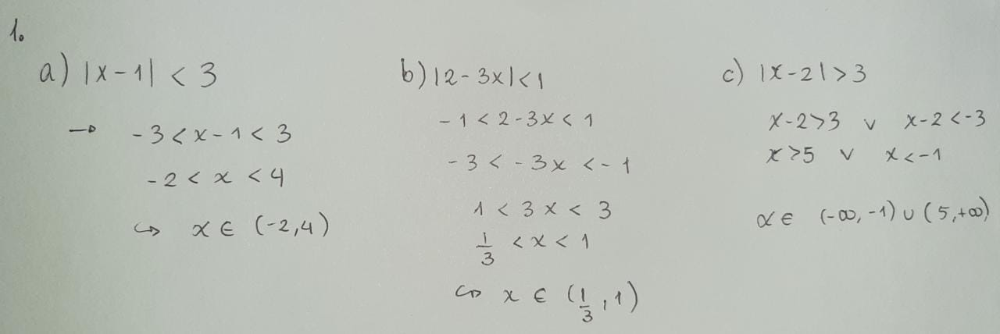
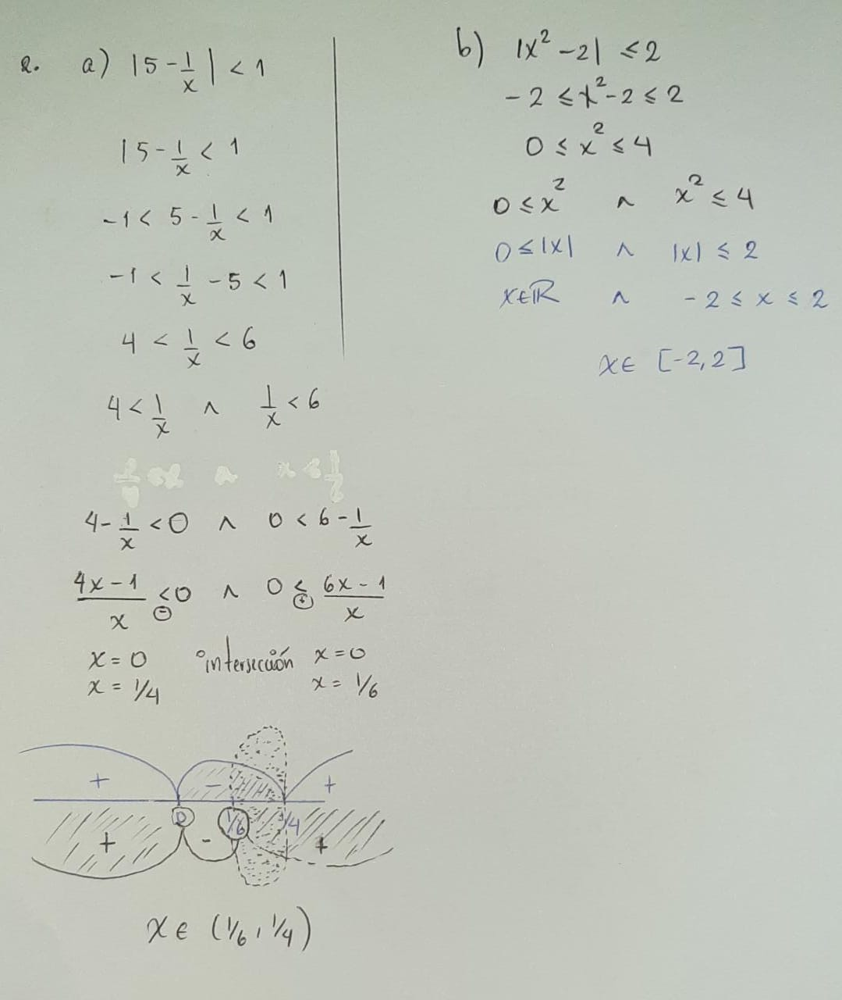
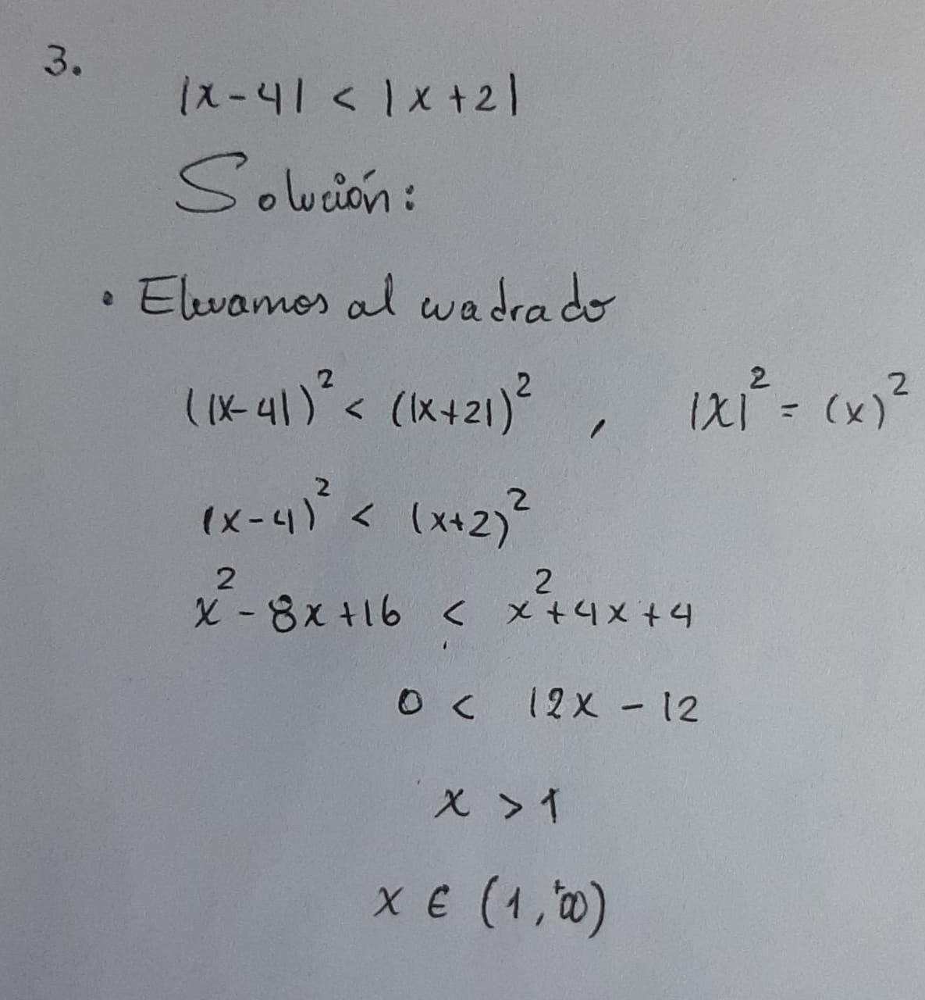
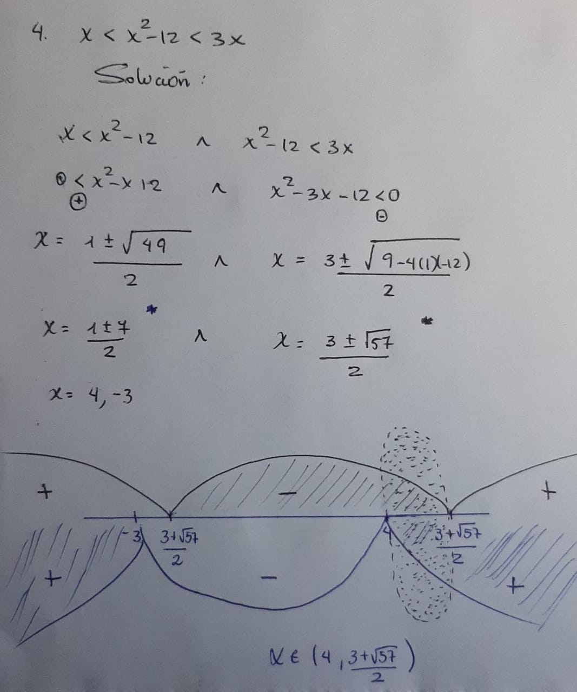
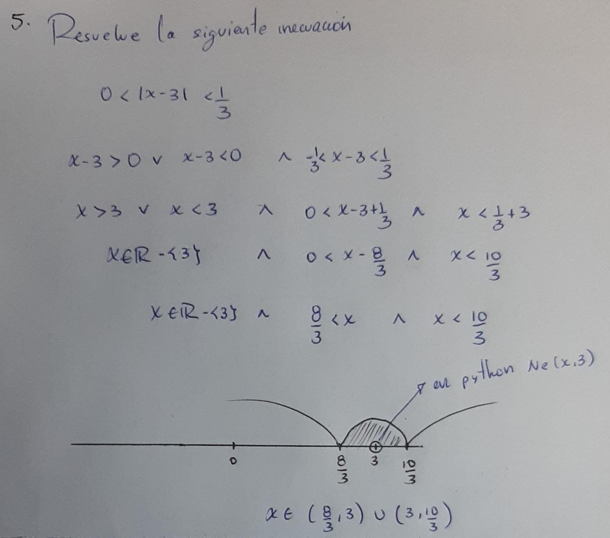
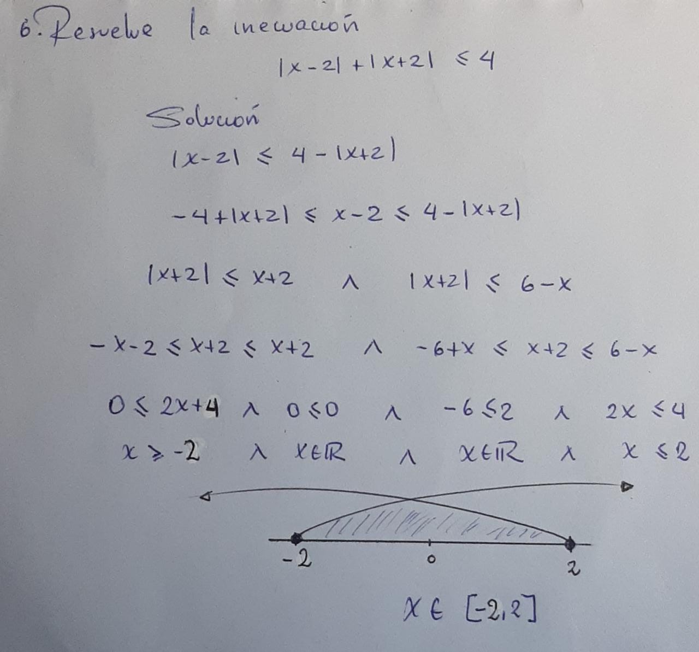
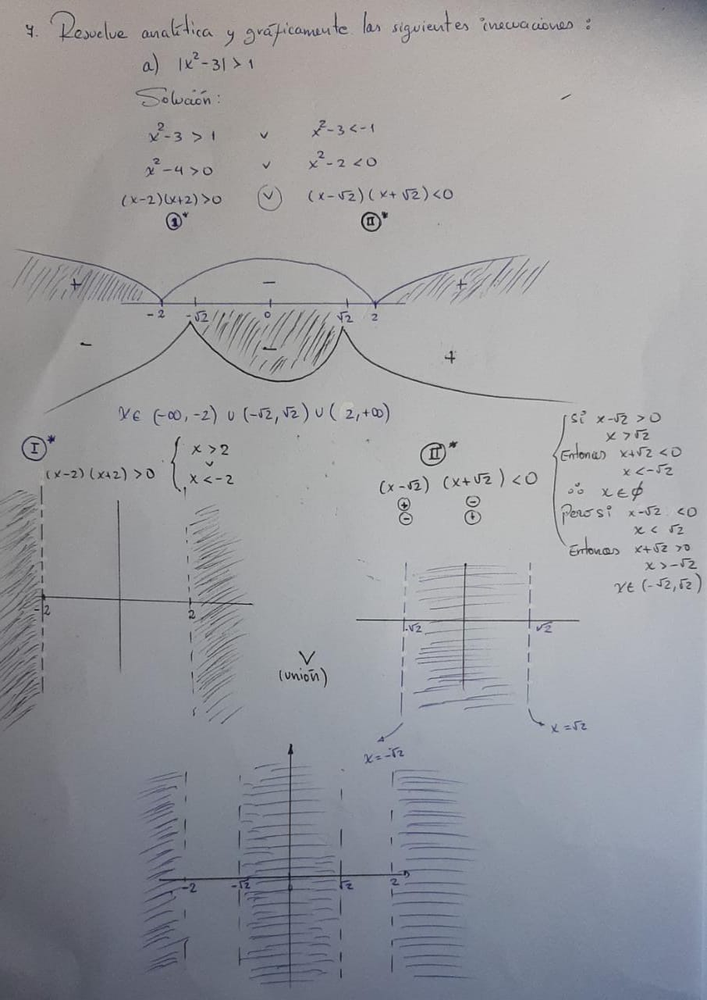
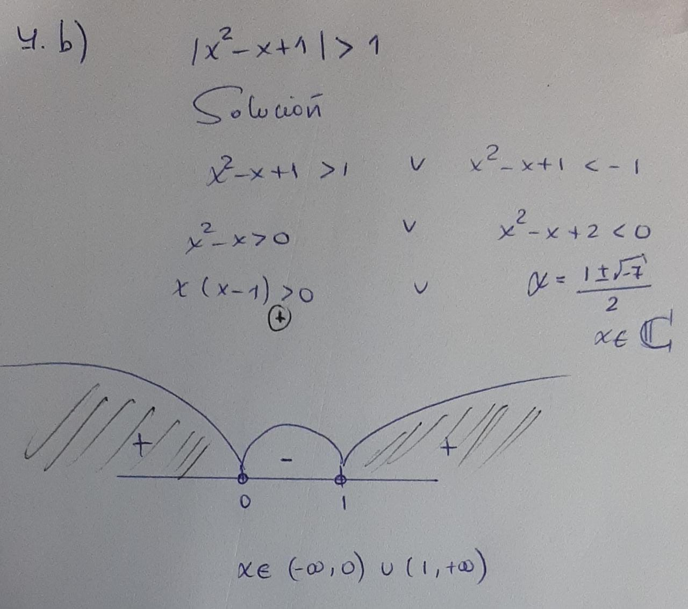
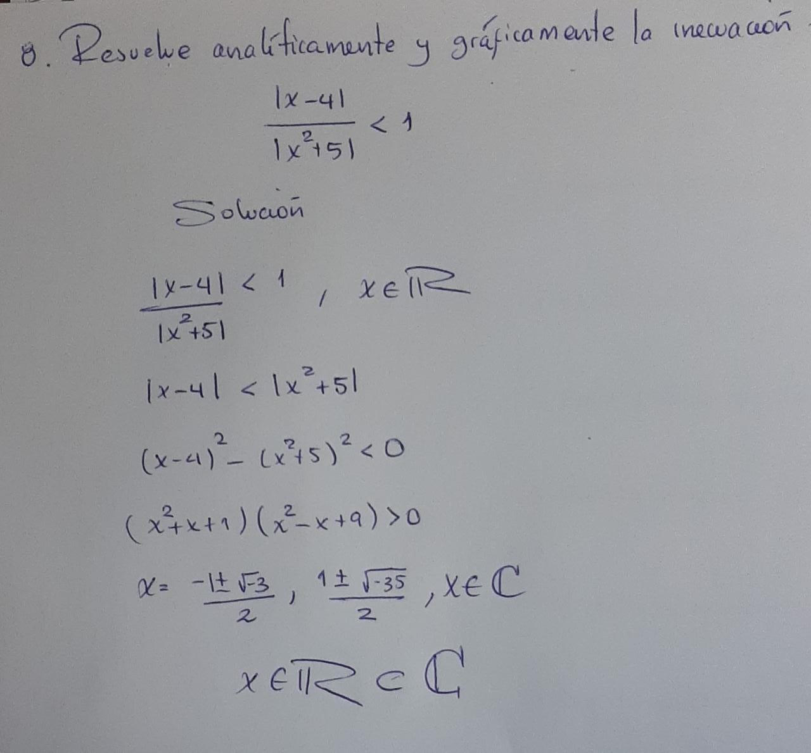

```{r setup, include=FALSE}
knitr::opts_chunk$set(warning = FALSE, message = FALSE) 
```

```{r eval=TRUE, echo=FALSE, message=FALSE}
.rs.restartR()
# tengo que tener mi path de mi python (variable de entorno)
# tengo que conectar mi reticulate con python (el de la varible de entorno)
# ahi recien podré usar mi pip del python
# en mi caso tengo el python unido al miniconda
# Eliminamos el reticulate e instalamos de nuevo
# SIEMPRE CORRER ESTAS LINEAS
Sys.setenv(RETICULATE_PYTHON = "C:/Users/Contreras/miniconda3/python.exe") # antes que todo
library(reticulate)
# py_config() # rutas
# py_install("sympy") # or en el terminal pip install sympy numpy pandas
```
# **Librarías**

Citando los códigos de [inecuaciones](https://colab.research.google.com/github/crdguez/aprendiendo_sympy/blob/master/inecuaciones.ipynb#scrollTo=iW7rNRG2PMFC).

```{python, message=FALSE}
from sympy import *
from IPython.display import Markdown as md
from IPython.display import display
from sympy import solve_poly_inequality, reduce_abs_inequality
from sympy.solvers.inequalities import solve_univariate_inequality, reduce_rational_inequalities
from sympy.parsing.latex import parse_latex
from sympy.plotting import plot
from __future__ import division
from sympy import *
x, y, z, t = symbols('x y z t')
k, m, n = symbols('k m n', integer=True)
f, g, h = symbols('f g h', cls=Function)
init_printing(use_latex=False)
```

```{python message = F, comment = '', echo = FALSE}
plot_implicit(abs(x - 1) < 3, (x, -4, 6), line_color='cyan') # este grafico no se mostrara
```

# **1. Resuelve las siguientes inecuaciones:**


```{r echo = FALSE, fig.align='center', comment = ''}

```

## **a) $|x−1|<3$**

```{python message = F, comment = ''}
solve_univariate_inequality(abs(x - 1) < 3, x, relational = False)
```
### ***Gráfico***

```{python message = F, comment = ''}
plot_implicit(abs(x - 1) < 3, (x, -4, 6), line_color='cyan')
```


## **b) $|2−3x|<1$**


```{python message = F, comment = ''}
solve_univariate_inequality(abs(2 - 3 * x) < 1, x, relational = False)
```
### ***Gráfico***

```{python message = F, comment = ''}
plot_implicit(abs(2 - 3 * x) < 1, (x, -2, 3), line_color='cyan')
```

## **c) $|x−2|>3$**


```{python message = F, comment = ''}
solve_univariate_inequality(abs(x - 2) > 3, x, relational = False)
```

### ***Gráfico***

```{python message = F, comment = ''}
plot_implicit(abs(x - 2) > 3, (x, -3, 7), line_color='cyan')
```

# **2. Resuelve analíticamente y gráficamente las siguientes inecuaciones**

```{r echo = FALSE, fig.align='center', comment = ''}

```

## **a)$|5−\frac{1}{x}|< 1$**

```{python message = F, comment = ''}
solve_univariate_inequality(abs(5 - 1/x) < 1, x, relational = False)
```

### ***Gráfico***

```{python message = F, comment = ''}
plot_implicit(abs(5 - 1/x) < 1, (x, 1/8, 1/3), line_color='cyan')
```

## **b) $|x^2−2| \le 2$**

```{python message = F, comment = ''}
solve_univariate_inequality(abs(x**2 - 2) <= 2, x, relational = False)
```

### ***Gráfico***

```{python message = F, comment = ''}
plot_implicit(abs(x**2 - 2) <= 2, (x, -3, 3), line_color='cyan')
```

# **3. Resuelve analíticamente y gráficamente la inecuación**

```{r echo = FALSE, fig.align='center', comment = ''}

```

## **$|x-4| < |x+2|$**

```{python message = F, comment = ''}
solve_univariate_inequality(abs(x - 4) < abs(x + 2), x, relational = False)
```

### ***Gráfico***

```{python message = F, comment = ''}
plot_implicit(abs(x - 4) < abs(x + 2), (x, 0, 4), line_color='cyan')
```

# **4. Resuelve la siguiente inecuación**

```{r echo = FALSE, fig.align='center', comment = ''}

```

## **$x< x^2 - 12 < 3x$**

```{python message = F, comment = ''}
reduce_rational_inequalities([[x < x**2 - 12, x**2 - 12 < 3*x]], x, relational = False)
```

### ***Gráfico***

```{python message = F, comment = ''}
plot_implicit(And(x < x**2 - 12, x**2 - 12 < 3*x), (x, 0, 9), line_color='cyan')
```

# **5. Resuelve la siguiente inecuación**

```{r echo = FALSE, fig.align='center', comment = ''}

```

## **$0<|x-3|<\frac{1}{3}$**

```{python message = F, comment = ''}
print(solve_univariate_inequality(0 < abs(x - 3), x, relational = False), "&", solve_univariate_inequality(abs(x - 3) < 1/3, x, relational = False))
```

### ***Gráfico***

```{python message = F, comment = ''}
plot_implicit(And(0 < abs(x - 3), abs(x - 3) < 1/3), (x, 1, 4), line_color='cyan')
```

# **6. Resuelve la inecuación**

```{r echo = FALSE, fig.align='center', comment = ''}

```

## **$|x-2| + |x+2| \le 4$**

```{python message = F, comment = '', warning = FALSE}
reduce_abs_inequalities([(Abs(x - 2) + Abs(x + 2) - 4, '<=')], x)
``` 

### ***Gráfico***

```{python message = F, comment = '', warning = FALSE}
plot_implicit(abs(x - 2) + abs(x + 2) <= 4, (x, -3, 3), line_color='cyan')
```

# **7. Resuelve analíticamente y gráficamente las siguientes inecuaciones**

```{r echo = FALSE, fig.align='center', comment = ''}

```

```{r echo = FALSE, fig.align='center', comment = ''}

```

## **a) $|x-2| + |x+2| \le 4$**

```{python message = F, comment = '', warning = FALSE}
reduce_abs_inequalities([(Abs(x**2 - 3) - 1, '>')], x)
``` 

### ***Gráfico***

```{python message = F, comment = '', warning = FALSE}
plot_implicit(abs(x**2 - 3) > 1, (x, -3, 3), line_color='cyan')
```

## **b) $|x^2-x+1| > 1$**

```{python message = F, comment = '', warning = FALSE}
reduce_abs_inequalities([(Abs(x**2 - x + 1) - 1, '>')], x)
solve_univariate_inequality(abs(x**2 - x + 1) > 1, x, relational = False)
``` 

### ***Gráfico***

```{python message = F, comment = '', warning = FALSE}
plot_implicit(abs(x**2 - x + 1) > 1, (x, -1, 2), line_color='cyan')
```

# **8. Resuelve analíticamente y gráficamente la inecuación**

```{r echo = FALSE, fig.align='center', comment = ''}

```

## **$|x-2| + |x+2| \le 4$**

```{python message = F, comment = '', warning = FALSE}
solve_univariate_inequality(abs(x - 4) / Abs(x**2 + 5) < 1, x, relational = False)
``` 

### ***Gráfico***

```{python message = F, comment = '', warning = FALSE}
plot_implicit(abs(x - 4) / Abs(x**2 + 5) < 1, (x, -1000, 1000), line_color='cyan')
```

# **9. Representa gráficamente los conjuntos de puntos $(x, y)$ tales que:**

## **a) $x>y$**

### ***Gráfico***

```{python message=FALSE, warning=FALSE, comment=''}
plot_implicit(x-y>0, (x, -10, 10), line_color='cyan')
```

## **b) $y\le2$**

### ***Gráfico***

```{python message = F, comment = '', warning = FALSE}
plot_implicit(y <= 2, (x, -10, 10), line_color='cyan')
```

## **c) $|x-y|<1$**

### ***Gráfico***

```{python message = F, comment = '', warning = FALSE}
plot_implicit(abs(x - y) < 1, (x, -10, 10), line_color='cyan')
```

# **10. Representa gráficamente los conjuntos de puntos $(x, y)$ tales que:**

## **a) $|x| + |y| = 1$**

### ***Gráfico***

```{python message=FALSE, warning=FALSE, comment=''}
plot_implicit(abs(x) + abs(y) - 1, (x, -1.5, 1.5), (y, -1.5, 1.5), line_color='cyan')
```

## **b) $|x-1| = |y-1|$**

### ***Gráfico***

```{python message = F, comment = '', warning = FALSE}
plot_implicit(abs(x - 1) - abs(y - 1), (x, -5, 5), (y, -5, 5), line_color='cyan')
```

## **c) $xy = 0$**

### ***Gráfico***

```{python message = F, comment = '', warning = FALSE}
plot_implicit(x * y, (x, -5, 5), (y, -5, 5), line_color='red')
```


# **11. Representa gráficamente los conjuntos de puntos $(x, y)$ tales que:**

## **a) $y = 2 - \frac{|x|}{x}$**

### ***Gráfico***

```{python message=FALSE, warning=FALSE, comment=''}
plot_implicit(y - 2 + abs(x) / x, (x, 0, 1), (y, 0, 2), line_color='cyan')
```

## **b) $(x-1)^2 + (y-3)^2 < 1$**

### ***Gráfico***

```{python message = F, comment = '', warning = FALSE}
plot_implicit((x-1)**2 + (y-3)**2 < 1, (x, -1, 3), (y, 1.5, 4.5), line_color='cyan')
```

## **c) $\frac{x^2}{4} + \frac{x^2}{9} = 1$**

### ***Gráfico***

```{python message = F, comment = '', warning = FALSE}
plot_implicit((x**2)/4 + (y**2)/9 - 1, (x, -4, 4), (y, -4, 4), line_color='cyan')
```